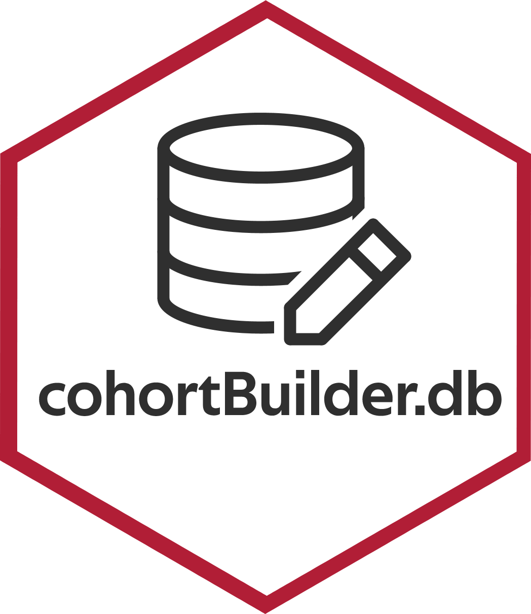

# cohortBuilder.db 

cohortBuilder.db is database layer for
[cohortBuilder](https://r-world-devs.github.io/cohortBuilder/) and
[shinyCohortBuilder](https://r-world-devs.github.io/shinyCohortBuilder/).
The package allows you to operate with `cohortBuilder` API on remote
tables stores within a database.

All of the operations are performed directly on the database server
side!

[](https://github.com/r-world-devs/cohortBuilder.db)
[](https://lifecycle.r-lib.org/articles/stages.html#stable)

## Installation

``` r
# CRAN version
install.packages("cohortBuilder.db")

# Latest development version
remotes::install_github("https://github.com/r-world-devs/cohortBuilder.db")
```

## Overview

`cohortBuilder.db` allows you to use `cohortBuilder` and
`shinyCohortBuilder` features working with database connection.

Comparing to the standard workflow (working on list of tables) you just
need to create database tables configuration using `dbtables` where you
provide database connection, schema name and table names. Than pass the
created object to `set_source` method:

``` r
library(cohortBuilder)
library(cohortBuilder.db)
db_tables_conf <- dbtables(
  connection = <db-connection>,
  schema = <schema-name>,
  tables = <vector-of-table-names-to-use>
)

librarian_db_source <- set_source(
  db_tables_conf
)
```

and configure Cohort using the same rules known from `cohortBuilder`:

``` r
librarian_db_cohort <- cohort(
  librarian_source,
  filter(
    "discrete", id = "author", dataset = "books", 
    variable = "author", value = "Dan Brown"
  ),
  filter(
    "range", id = "copies", dataset = "books", 
    variable = "copies", range = c(5, 10)
  ),
  filter(
    "date_range", id = "registered", dataset = "borrowers", 
    variable = "registered", range = c(as.Date("2010-01-01"), Inf)
  )
) 
```

Now feel free to use all the known `cohortBuilder` features.

You can also use `shinyCohortBuilder` to use `cohortBuilder` features in
shiny. Just use db-based Cohort with the known approach:

``` r
library(shiny)
library(shinyCohortBuilder)

ui <- fluidPage(
  sidebarLayout(
    sidebarPanel(
      cb_ui("librarian")
    ),
    mainPanel(
      verbatimTextOutput("cohort_data")
    )
  )
)

server <- function(input, output, session) {
  cb_server("librarian", librarian_db_cohort)
  
  output$cohort_data <- renderPrint({
    input[["librarian-data-updated"]]
    get_data(librarian_cohort)
  })
  
}

shinyApp(ui, server)
```

## Step strategies

Each filtering step can either stay a lazy `dbplyr` query or be written
to a temporary table before the next step reads it. The behaviour is
controlled with a single option:

``` r
options(cohortBuilder.db.step_strategy = "lazy")                  # default, nothing is materialized
options(cohortBuilder.db.step_strategy = "materialize")           # every table computed in every step
options(cohortBuilder.db.step_strategy = "materialize_selective") # only tables touched by the step
```

See `vignette("step-strategy", package = "cohortBuilder.db")` for when
to pick each one.

## Acknowledgement

Special thanks to:

- [Kamil Wais](mailto:kamil.wais@gmail.com) for highlighting the need
  for the package and its relevance to real-world applications.
- [Adam Foryś](mailto:adam.forys@gmail.com) for technical support,
  numerous suggestions for the current and future implementation of the
  package.

## Getting help

In a case you found any bugs, have feature request or general question
please file an issue at the package
[Github](https://github.com/r-world-devs/cohortBuilder.db/issues). You
may also contact the package author directly via email at
[krystian8207@gmail.com](mailto:krystian8207@gmail.com).
